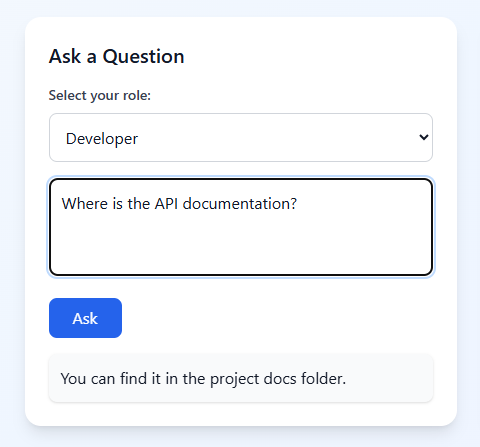

# LumioAI 🔆


LumioAI is an AI-powered learning assistant frontend built with React and Tailwind CSS.  
A futurist, minimalist, and motivating interface designed to help users explore, learn, and generate personalized learning plans 🙂.

---

## Table of Contents
- [About the Project](#about-the-project)
- [Features](#features)
- [Technologies](#technologies)
- [Getting Started](#getting-started)
- [Usage](#usage)
- [Beta / Development Stage](#beta--development-stage)
- [About the Author](#about-the-author)
- [License](#license)

---

## About the Project

LumioAI is a modern frontend application for an AI-powered learning assistant.  
It provides users with:

- An interactive **AskForm** to ask questions to the AI.
- A **Personalized LearningPlan generator** to guide their learning journey.
- A motivational and visually pleasing user interface with animated hero section and feature icons.

### Screenshots
  

The goal is to make learning enjoyable and intuitive while showcasing modern frontend technologies and design trends of 2025.

---

## Features

- Ask questions and get AI-powered answers.
- Generate a personalized learning plan based on your role (Developer / Analyst).
- Responsive, clean, and modern design with Tailwind CSS.
- Hero section with animated backgrounds and interactive feature icons.

### Screenshots



---

## Technologies

- React
- Tailwind CSS
- Vite
- JavaScript
- Lucide Icons

---
¡Perfecto, Moni! 😄 Aquí tienes **todo desde Getting Started hasta License**, con todos los títulos y secciones completos en un solo bloque listo para copiar:

````markdown
## Getting Started

To run LumioAI locally:

1. Clone the repository:

```bash
git clone https://github.com/monicamontesb/LumioAI.git
````

2. Navigate to the frontend folder:

```bash
cd lumio-frontend
```

3. Install dependencies:

```bash
npm install
```

4. Start the development server:

```bash
npm run dev
```

5. Open your browser at `http://localhost:5173` to see the app in action.

---

## Usage

* Ask questions in the AskForm.
* Generate your personalized learning plan.
* Explore the animated hero section and feature highlights.

---

## Beta / Development Stage

> ⚠️ Beta / Work in Progress:
> LumioAI is currently in its early beta stage. The AI is simulated with sample data, and a proper database is not yet implemented. Features and data are placeholders for demonstration purposes.

---

## About the Author

This project was created by **Moni**💛, a Software Engineer and aspiring Full-Stack Developer with a passion for learning, technology, and creative expression.
I love blending code with design, turning ideas into interactive and visually engaging experiences.

When I’m not exploring data or building web apps, I immerse myself in art, creativity, and design—always looking for ways to make technology human and inspiring ✨🎨.

GitHub: [monicamontesb](https://github.com/monicamontesb)

---

## License

This project is licensed under the MIT License.
